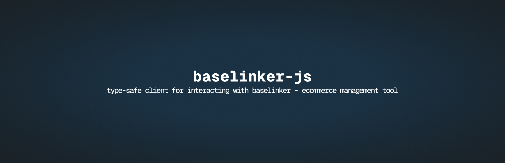

## Installation

Install the package using your preferred package manager:

```bash
bun add baselinker-js

# or

pnpm add baselinker-js

# or

yarn add baselinker-js

# or

npm install baselinker-js
```

## Usage

Define a baselinker client, and provide your BaseLinker API key:

```typescript
// src/lib/baselinker.ts
import { createBaselinkerClient } from "baselinker-js";

const bl = createBaselinkerClient({
  apiKey: "YOUR_API_KEY",
});

export { bl };
```

Now you can use the client to interact with the BaseLinker API:

```typescript
try {
  const query = await client.products.getInventories();

  if (query.status === "ERROR") {
    throw new Error(query.error_message);
  }

  query.inventories.forEach((inventory) => {
    console.log(inventory);
  });
} catch (error) {
  console.error(error);
}
```

## Documentation

Entire structure and types of the client are based on the [BaseLinker API documentation](https://api.baselinker.com/).

> Note: The client is updated up to **2025-02-19** version of the API.
>
> Please, verify if the client is up to date in the documentation.
>
> You can also find the official [BaseLinker API changelog](https://api.baselinker.com/?changelog) to check for any changes.
